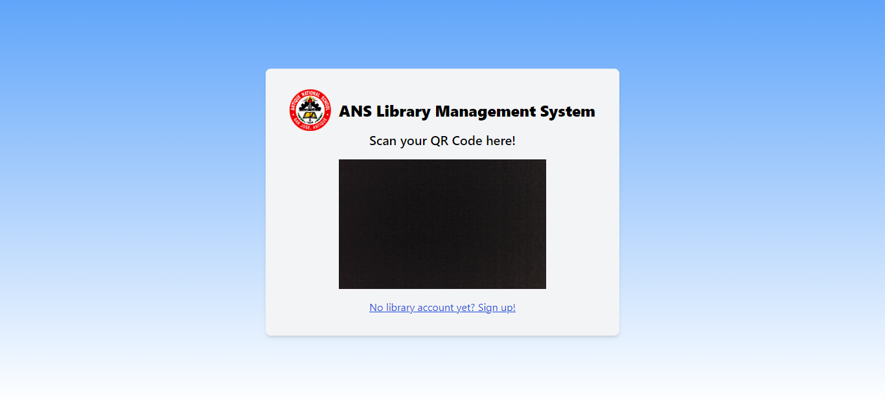

<h2>
    📁Library Management System
    
</h2>

📝A library management system is a sophisticated software solution designed to streamline and automate the various tasks associated with operating a library. It efficiently manages the cataloging of books, handles student registration, and assists in inventory management. This system not only enhances the organization and accessibility of library resources but also enables librarians to monitor library activities and generate reports.

## 💻 Technologies

    
    
    
    
    
    
    

## 📖 Manual

- Set-up XAMPP

  > - Download the XAMPP application here: https://www.apachefriends.org/download.html
  > - Install the application.

- Install the project.

  > - Navigate to the XAMPP > htdocs file folder.
  > - Clone this repository inside the htdocs folder: https://github.com/rieza-ix/library-management-system.git

  or

  > - Download the zip file.
  > - Unzip the project file in XAMPPS's file folder, XAMPP > htdocs.
  > - Then paste the library-management-system file folder inside the htdocs folder.

- Set-up database

  > - In your http://localhost/phpmyadmin/, create a new database and name it 'library_management_system'
  > - Select the 'library_management_system'
  > - Click 'Import' in the tabs.
  > - Click the 'Choose File' button.
  > - Then select the file from the project folder located in server > db > library_management_system.sql.

- Run the project.
  > - Open the XAMPP Control Panel.
  > - Start Apache and MySQL.
  > - For librarians, navigate to this link: http://localhost/library-management-system/client/index.php.
  > - For students, navigate to this link: http://localhost/library-management-system/client/index2.php.

## ✨ Features

- Students can login using the QR code embedded in their IDs.
  
- Both students and librarians can access the card catalog by searching for the book and clicking the title.
  
- The librarian can only access this module for validation purposes.
  
- The librarian can mark the borrowed book as returned if the borrower has given the book back.
  
- The librarian can manage and monitor all the book details as well as the status of the book in this module.
  
- Here, the librarian can monitor the top borrowers as well as the most borrowed books in the library.
  

## 👥 Credits

- Rieza Marie Banquillo (Project Analyst / Front-end Developer)
- Loren Fernando (Back-end Developer)
- Sunny Virgo (Assisted the developers)
- Sufena Joy Laude (Documentation)
- Kurly Jhon Calubiran

> Client: **Antique National School Librarians**
